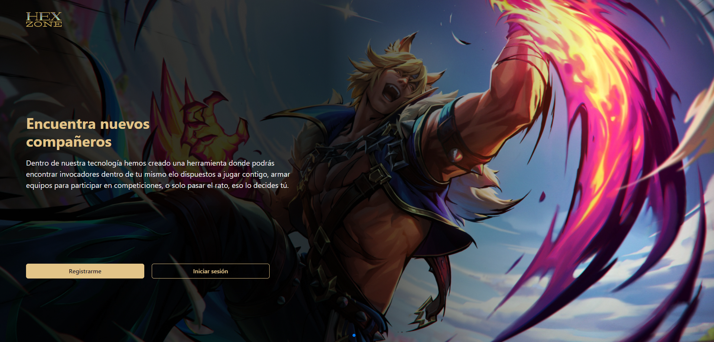

<h1 align="center">
  <br>
  <a href="http://www.amitmerchant.com/electron-markdownify"></a>
  <br>
  Hex Zone
  <br>
</h1>

<h4 align="center">Una red social hecha para y por jugadores de  <a href="https://www.leagueoflegends.com/es-es/" target="_blank">League of Legends</a>.</h4>

<p align="center">
  
  
  
  
  
  
  
  
  
  
  
</p>

<p align="center">
  <a href="#caracteristicas">Caracteristicas</a> •
  <a href="#como-usar">Como usar</a> •
  <a href="#integrantes">Credits</a>
</p>



## Caracteristicas

* Datos y estadisticas del rendimiento propio dentro del juego
* Contactar con jugadores dentro de un rango de rank para poder interactuar
* Chat incluido para mantener comunicacion y arreglar partidas con otros jugadores
* Posteos de comentarios, interacciones entre summoners

## Como usar

Para clonar y correr esta aplicacion, necesitaras [Git](https://git-scm.com) y [Node.js](https://nodejs.org/en/download/) (que viene con [npm](http://npmjs.com) incluido) instalado en tu computadora. Desde la linea de comandos:

```bash
# Clona el repositorio
$ git clone https://github.com/No-Country/c13-25-m-node-react

# Go into the repository
$ cd c13-25-m-node-react

# Instala las dependencias
VER NOTA
$ cd server
$ cd client
$ npm install

# Corre la app
$ npm start
```

> **Nota**
> Debes instalar las dependencias tanto para el server como para el client yendo a cada carpeta e instalando sus respectivas dependencias y para correr la app deberas correr ambas instancias del proyecto, la del server tanto como la del client


## Integrantes

This software uses the following open source packages:

- [Cristian Orlando](https://github.com/) (UX/UI - PM)
- [Leandro Mancilla](https://github.com/) (UX/UI)
- [Ailin Dalffaro](https://github.com/) (UI)
- [Andrea Cambra](https://github.com/AndyCambra) (UI - Front End)
- [Leandro Nicolas Maranda](https://github.com/leandroni1983) (Front-End)
- [Franco Falcon Heredia](https://github.com/Francoheredia) (Front-End)
- [Maurizio De Marchis](https://github.com/mauriziodm91) (Back-End)
- [Esteban Adrian Gonzalez](https://github.com/adremess) (Back-End)

